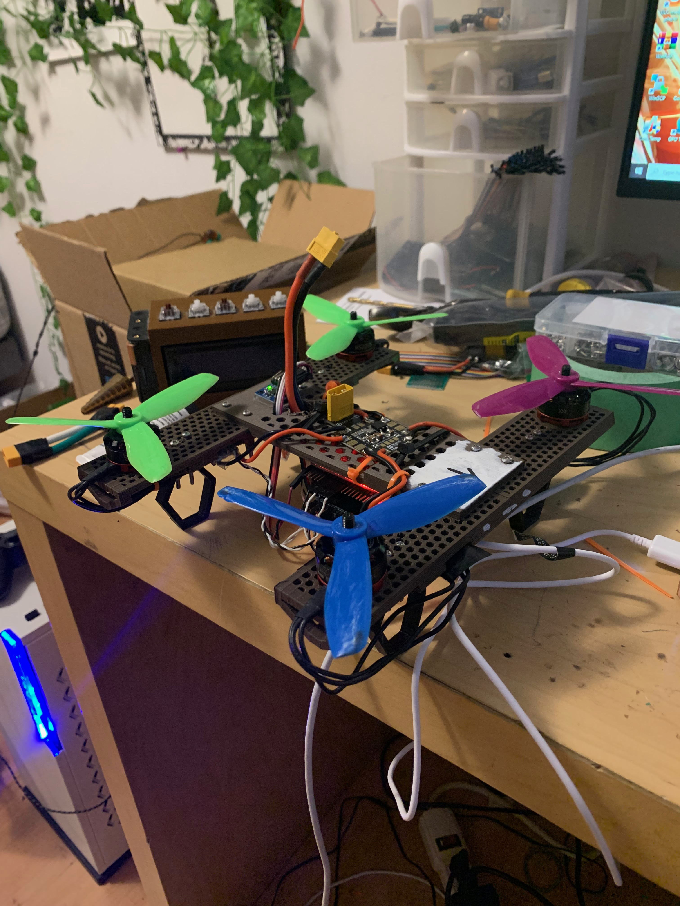
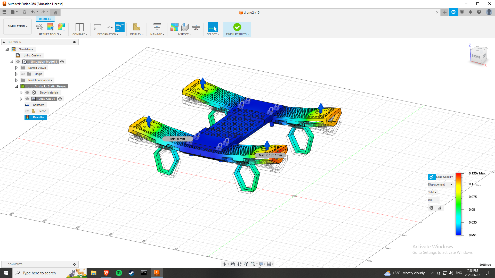
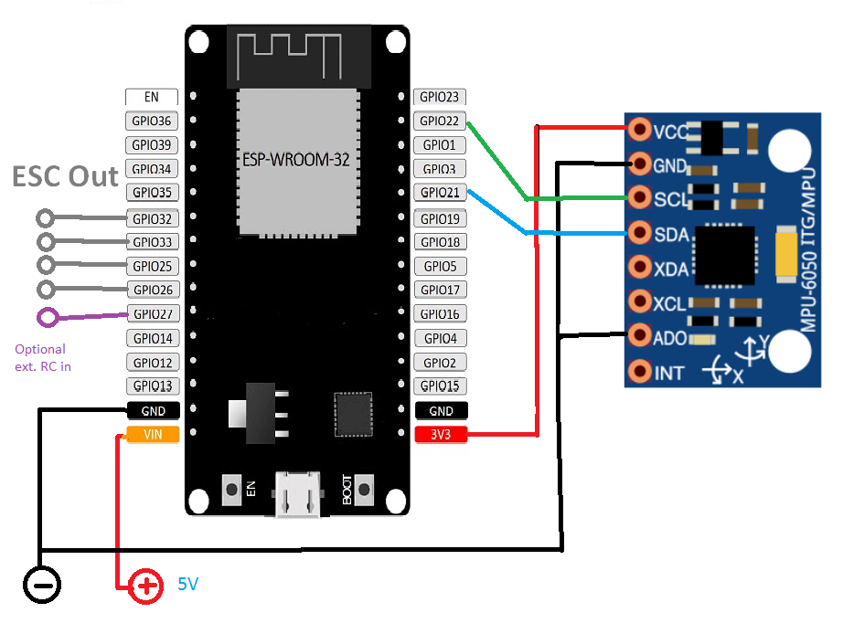

# autonomous Drone

Second attempt at autonomous drone 2 years later, using esp32 drone repo by PepeTheFroggie for PID and motor control code.

Using ps3 controller with [sixaxispairer](https://github.com/user-none/sixaxispairer) and [esp32-ps3](https://github.com/jvpernis/esp32-ps3) for flight testing

3d Printed frame, raspi zero W for processing, esp32 for flight control, [rs2205 motors](https://www.aliexpress.com/item/1005001270601236.html?spm=a2g0o.order_list.order_list_main.122.6ecf1802ioyX7h) and included escs

Big thanks to original repo creator for something to work off of with the PID code

